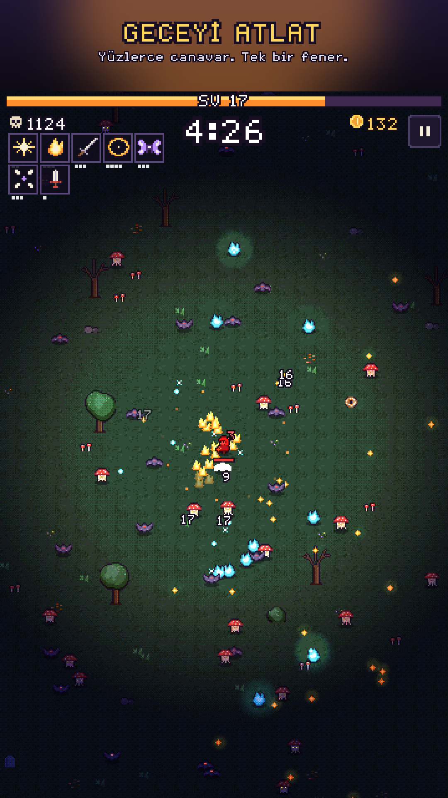
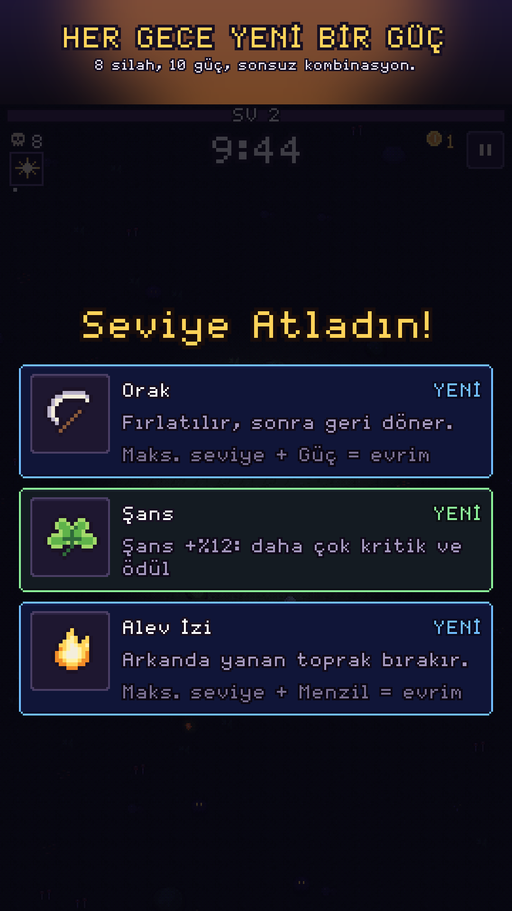

# Last Lantern (Son Fener)

Dikey ekranda tek başparmakla oynanan, piksel sanatlı bir "survivors-like" roguelite.
Dünya bitmeyen bir geceye gömüldü ve son fener sende. Her oyun bir gece (10 dakika) sürüyor.
Silahlar kendiliğinden ateş ediyor; sen hareket ediyor, köz topluyor, güçleniyor ve şafağı
görmeye çalışıyorsun.

**Platform:** Android (Google Play) · **Teknoloji:** libGDX 1.14 · Kotlin 2.4 · Gradle 8.14

| | |
|---|---|
|  |  |

## İçerik

- 4 kahraman, 8 silah + 8 evrim, 10 pasif güç
- 3 gece (Fısıldayan Orman, Batık Köy, Donmuş Zirve), her birinde ara boss ve şafak bossu, ayrıca Sonsuz mod
- 14 kalıcı kamp güçlendirmesi, 30 başarım
- Türkçe ve İngilizce, çevrimdışı oynanabilir
- Gelir modeli: isteğe bağlı ödüllü reklam (bir kez dirilme, 2x altın) ve tek seferlik "Destekçi Paketi"

## Modüller

| Modül | İçerik |
|---|---|
| `core/` | Oyunun tamamı (saf Kotlin/JVM): simülasyon, çizim, arayüz, kayıt |
| `lwjgl3/` | Masaüstü başlatıcı: geliştirme, otomatik oynatma, ekran görüntüsü |
| `android/` | Android başlatıcı, AdMob + UMP, Play Billing, In-App Review |
| `tools/` | Varlık üreticileri (Python) ve atlas paketleyici |
| `assets/` | Üretilmiş varlıklar: atlas, font, ses, müzik, çeviriler |
| `store/` | Mağaza metinleri, ikon, öne çıkan grafik, ekran görüntüleri (EN/TR) |
| `docs/` | Gizlilik politikası ve **[Yayın Rehberi](docs/YAYIN_REHBERI.md)** |

## Komutlar

```bash
./gradlew :core:test                    # birim, içerik ve denge testleri
./gradlew :lwjgl3:run                   # masaüstünde oyna (WASD, Esc)
./gradlew :android:assembleDebug        # Android SDK gerekir (ANDROID_HOME)

./gradlew :core:test --tests '*BalanceProbe*' -Pprobe -PprobeStages=woods,drowned,frozen
./gradlew :core:test --tests '*WeaponDpsProbe*' -Pprobe

python3 tools/gen_all.py --audio        # bütün varlıkları yeniden üret (pillow, numpy, scipy, ffmpeg)
tools/capture.sh 720x1280 captures      # masaüstünden ekran görüntüleri
```

Android SDK yoksa `:android` modülü otomatik olarak devre dışı kalır. APK ve AAB her push'ta
GitHub Actions'ta derlenir (`.github/workflows/last-lantern-android.yml`). Aynı iş akışı 16 KB
sayfa hizasını doğrular ve oyunu bir emülatörde açıp çökme olup olmadığını denetler.

## Tasarım notları

- **Işık oynanışın parçası:** silahlar yalnızca fenerin aydınlattığı düşmanları hedefler.
  Karanlıktaki düşmanların yalnızca gözleri görünür. Fener Yağı ışığı genişletir.
- **Piksel-mükemmel görüntü:** dünya sanal çözünürlükte üç ayrı tampona (sahne, ışık, üst katman)
  çizilip ekrana tam sayı ölçekle büyütülür. Işık kademeli ve titreşimli (dither) gölgelenir.
- **Deterministik simülasyon:** sabit 60 Hz adım ve seed'li RNG. Denge, beceri seviyesi
  ayarlanabilen bir botla ölçülür (`BalanceProbe`).
- **Performans:** dizi tabanlı havuzlar ve uzamsal karma; 550 düşmanla bir simülasyon adımı
  yaklaşık 0,35 ms sürer.
