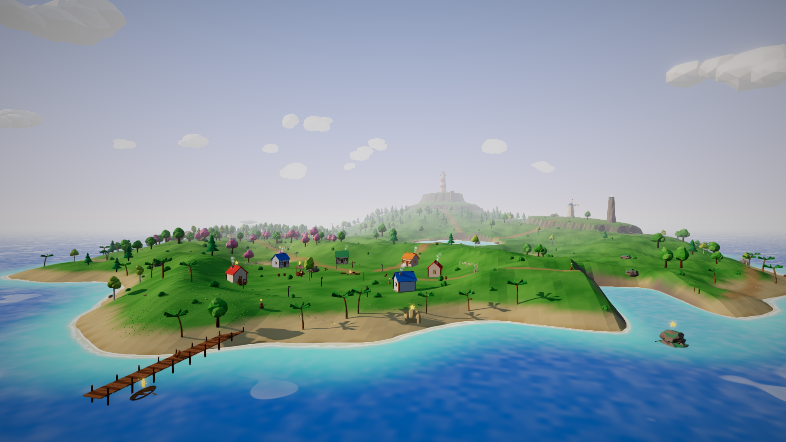
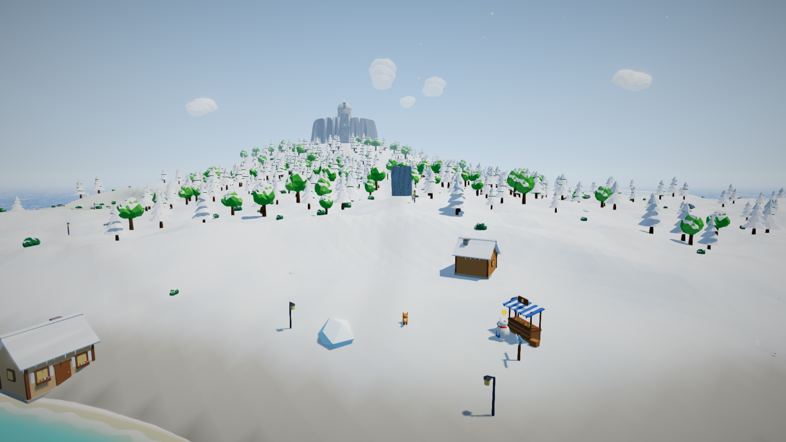
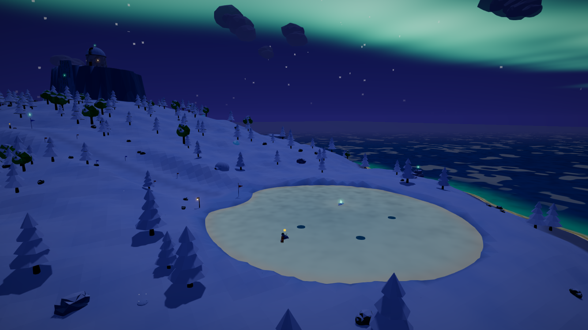
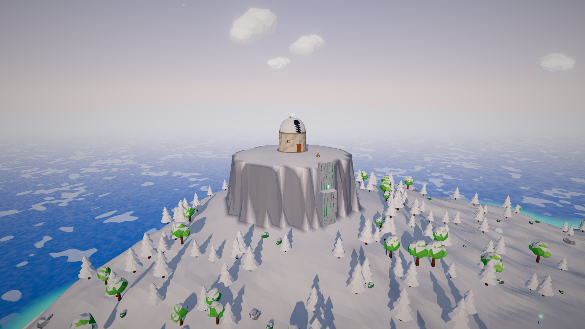
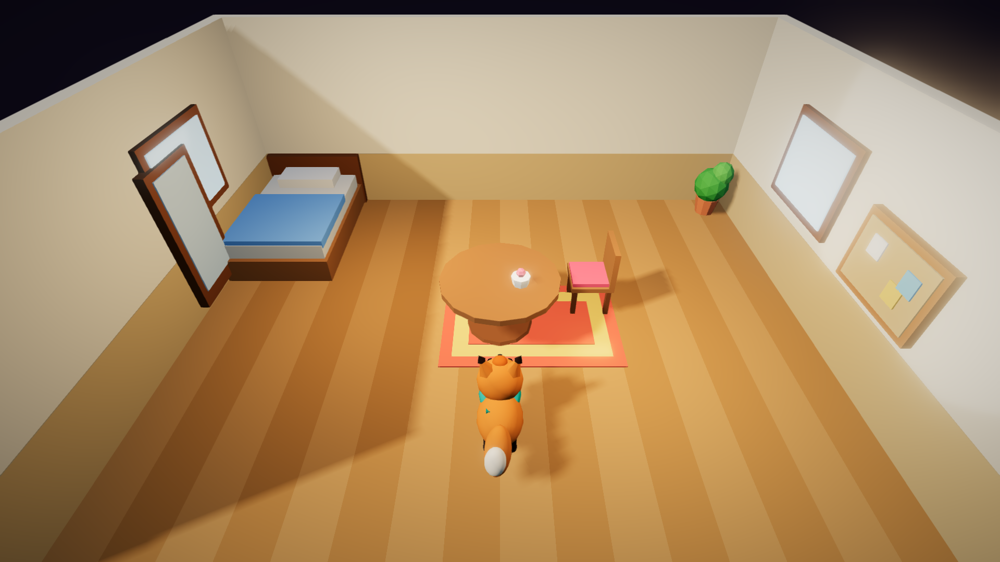
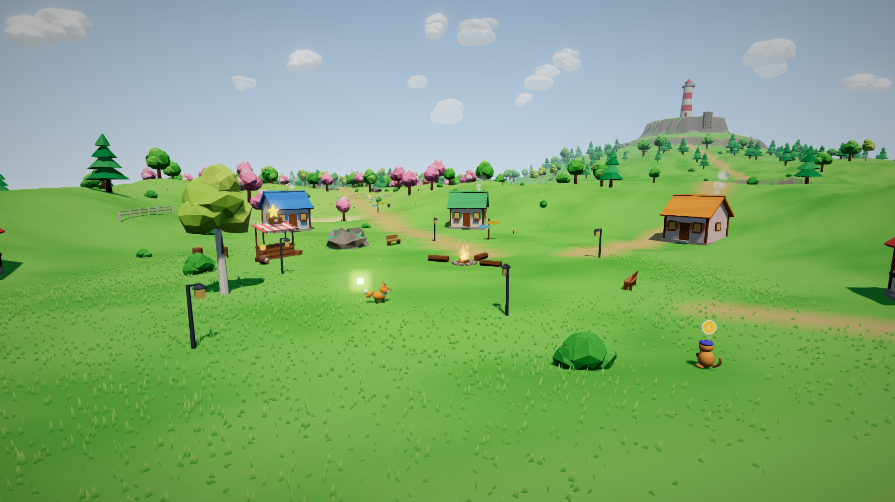
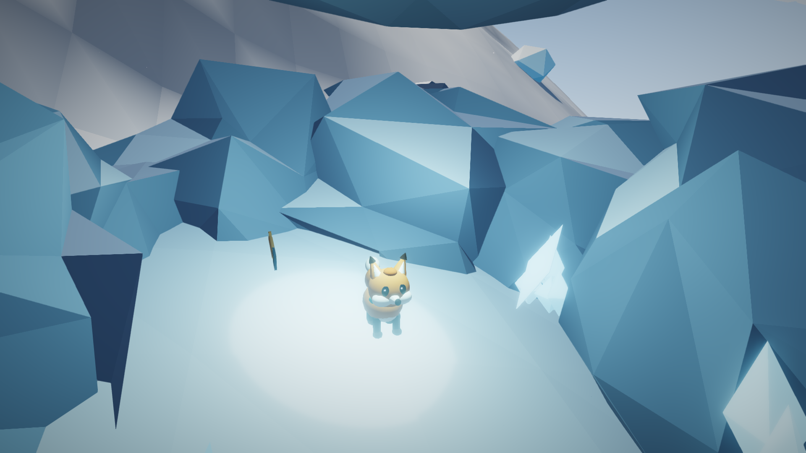

# Yıldız Adası / Starfall Isle

Rahat bir 3D ada macerası. Küçük tilki **Mina**, fırtınada sönen adanın fenerini yeniden yakmak
için gökten düşen yıldız parçalarını topluyor; sonra yelkenini açıp kuzeydeki **Kar Adası**'na
gidiyor ve eski rasathanenin teleskobunu kuzey ışıklarıyla onarıyor. Koşuyor, zıplıyor, altın
tüylerle havada kanat çırpıyor, süzülüyor, yüzüyor, tırmanıyor, kızakla kayıyor, tekne
kullanıyor, hazine kazıyor ve adalılara yardım ediyor. Ölüm yok, acele yok; her yaşa uygun.

Yerel bir masaüstü oyunu: **C# / .NET 8 + OpenGL 3.3** (Silk.NET). Tarayıcı, Node ya da harici
motor yok; `dotnet run` ile açılır, `dotnet publish` ile Windows `.exe` / Linux ikilisi olur.
Steam başarımları Steamworks.NET ile (Steam yoksa yerel kaydedilir). TR / EN.



| | |
|---|---|
|  |  |
|  |  |
|  |  |

## Çalıştırma

[.NET 8 SDK](https://dotnet.microsoft.com/download) yeter (Windows, Linux, macOS).

```bash
cd Starfall
dotnet run                     # oyun penceresi
dotnet run -c Release          # optimize derleme
```

Visual Studio / Rider: depo kökündeki `PixelSurvival.sln` içinde **Starfall** projesini
başlangıç projesi yapıp F5.

### Exe üretmek

```bash
dotnet publish -c Release -r win-x64   -o publish/win-x64     # Starfall.exe + glfw3.dll + soft_oal.dll
dotnet publish -c Release -r linux-x64 -o publish/linux-x64   # Starfall + libglfw.so.3 + libopenal.so
```

Çıktı kendi içinde (self-contained): oyuncunun bilgisayarında .NET kurulu olması gerekmez.
Klasördeki dosyaları birlikte dağıtın (yerel kütüphaneler exe'nin yanında durmalı).
Bütün varlıklar (yazı tipleri, ikonlar, çeviriler, shader'lar) exe'nin içine gömülüdür; modeller
kodla üretilir, sesler ve müzik çalışırken sentezlenir. Ses/model/doku dosyası yoktur.

## İçerik

- **İki ada, 15 bölge.**
  - *Yıldız Adası:* Liman Köyü, Çiçekli Çayır, Fısıltı Ormanı, Kristal Göl, Batık Gemi Koyu,
    Mantar Vadisi, Rüzgârlı Kayalıklar, Fener Zirvesi + gizli Yıldız Mağarası.
  - *Kar Adası:* Buzlu Liman, Çam Yamacı, Donmuş Göl, Sıcak Su Kaynağı, Rasathane Zirvesi +
    gizli Buz Mağarası. Kar yağışı, buz, sıcak su buharı, gece kuzey ışıkları.
  - Gece-gündüz döngüsü (12 dakika), ateş böcekleri, yanan pencereler, dönen fener ışığı.
- **Hareket:** koşma, depar, zıplama, her altın tüy için havada bir kanat çırpma, süzülme,
  yüzme, zıplatan dev mantarlar, rüzgâr sütunları, **sarmaşıklı duvarlara tırmanma**
  (dayanıklılık = 3 sn + her tüy için 1 sn), **buzda kayma**, **kızak**, **yelkenli tekne**
  (iki ada arasında gerçek deniz yolculuğu).
- **Toplanacaklar:** 30 Yıldız Parçası, 8 Altın Tüy, 140 Deniz Kabuğu (dükkân parası),
  15 Aurora Kristali, 5 hazine sandığı (zincirleme hazine haritaları), 12 kazı noktası.
- **12 adalı, 11 görev:** Bilge Baykuş (ana hikâye: fener, sonra rasathane), Diken Usta
  (dükkân), Pamuk (kaçan havuçlar), Usta Kunduz (köprü, sonra teknenin yelkeni), Zıpzıp
  (kurbağa yarışı), Koca Bal (balıkçılık), Profesör Köstebek (kürek + hazine haritaları),
  Foto (6 konunun fotoğrafı), Paytak (kızak yarışı), Deniz (buzda balık), Kaya (tırmanma
  dersi), Bulut (kış dükkânı + kayıp eldiven).
- **Balıkçılık:** 10 tür; 4'ü yalnızca donmuş göldeki buz deliklerinde, bazıları gece.
- **İki final:** fener yanar (havai fişekler, jenerik); 15 kristalle teleskop onarılır, gökte
  kuzey ışıkları ve tilki takımyıldızı belirir. Sonrasında serbest oyun.
- **Özelleştirme:** 26 kıyafet (şapka, gözlük, sırt, atkı rengi; dükkân, hazine, görev
  ödülü) ve **Mina'nın evi**: köydeki kulübenin içi, 10×8 ızgaraya 26 mobilyayı
  yerleştir / döndür / kaldır (kilimler ayrı katman, tablolar arka duvara). Kesit kamerası.
- **43 Steam başarımı** (liste: [`steam/ACHIEVEMENTS.md`](steam/ACHIEVEMENTS.md)), photo mode
  (6 filtre), 3 kayıt yuvası, otomatik kayıt, tam gamepad desteği, ayarlar (ses, grafik
  kalitesi, VSync, tam ekran, hassasiyet, Y ters, yazı boyutu, kamera sarsıntısı, dil).

## Kontroller

| Eylem | Klavye / fare | Gamepad |
|---|---|---|
| Hareket | WASD / ok tuşları | sol çubuk |
| Kamera | fare (pencereye tıkla), Q / R, tekerlek: yakınlaştır | sağ çubuk |
| Zıpla · havada kanat çırp · basılı tut: süzül · duvara tutun | Space | A |
| Koş | Shift | B / RB |
| Konuş · olta at · tekneye bin · kaz | E / F | X |
| Günlük (harita, görevler, koleksiyon) | Tab / J | Back / View |
| Gardırop | G | mola menüsü |
| Fotoğraf modu | P | Y |
| Mola menüsü | Esc | Start |
| Ev düzenleme: seç · yerleştir · döndür · kaldır | Q/E · Space · R · X | LB/RB · A · Y · X |

## Kayıtlar

Windows `%APPDATA%\StarfallIsle`, Linux `~/.local/share/StarfallIsle`, macOS
`~/Library/Application Support/StarfallIsle`. Yazım atomik (geçici dosya + taşı + `.bak`
yedeği); bozuk kayıt yedekten açılır.

## Steam'e çıkarmak

1. Steamworks'te uygulama oluşturun; App ID'yi `steam_appid.txt` dosyasına ve
   `steam/*.vdf` içindeki 480/481/482 yerine kendi App/Depot ID'lerinize yazın.
2. Steamworks SDK'daki `steam_api64.dll` / `libsteam_api.so` dosyalarını
   `steam/redist/<rid>/` altına koyun ([ayrıntı](steam/redist/README.md)); publish onları exe'nin
   yanına kopyalar.
3. Başarımları [`steam/ACHIEVEMENTS.md`](steam/ACHIEVEMENTS.md) tablosundaki API adlarıyla
   girin; ikonlar `steam/achievement_icons/` (256×256 ve 64×64) içinde hazır.
4. Mağaza ve kütüphane görselleri `steam/store_art/` altında, Steam'in istediği ölçülerde
   (TR + EN capsule'ler, şeffaf logo, yazısız 3840×1240 kahraman görseli, 12 ekran görüntüsü).
5. İki publish'i üretip `steamcmd +login <kullanıcı> +run_app_build <tam yol>/steam/app_build.vdf +quit`.

Steam istemcisi açık değilse ya da kütüphane yoksa oyun "Çevrimdışı (yerel başarımlar)"
modunda sorunsuz çalışır.

## Doğrulama (oyunun içinde)

```bash
dotnet run -- --verify      # 246 statik denetim
dotnet run -- --playtest    # 92 uçtan uca denetim, gerçek girdi enjeksiyonuyla (pencere açmaz)
```

- `--verify`: çeviri anahtarlarının eşitliği, başarım şeması ve istatistik bağları, her eşiğin
  ulaşılabilirliği, arazi determinizmi, zıplama fiziği ve tırmanma dayanıklılığı, her eşyanın
  zemine yakın / çarpışma dışında / suyun üstünde oluşu, tekne iskeleleri ve deniz yolunun
  derinliği, kızak yolunun eğimi, hazine zinciri, mobilya ızgarası.
- `--playtest`: sabit 60 Hz adımla gerçek tuş basışlarıyla oynar: yürüme, zıplama yüksekliği,
  kanat çırpma, süzülme, yüzme, bütün toplanabilirler, bütün görevler ve yarışlar, ilk final;
  sonra tekneye binip yelkenle Kar Adası'na gider, eğitim duvarına ve rasathane uçurumuna
  tırmanır, kızak yarışını kazanır, buz deliğinden balık tutar, hazineleri kazar, fotoğrafları
  çeker, evi döşer, ikinci finali izler; **43 başarımın hepsi** açılır, kaydedip yeniden yükler.
- Ekran görüntüsü: `dotnet run -- --new 1 --capture shot.png --frames 90 --pos x,y,z --hour 21`
  (`--cam`, `--look`, `--ui journal`, `--house edit`, `--size 1920x1080`, `--hideui` ...).

Hepsi bu depoda, GPU'suz bir Linux konteynerinde (Mesa + Xvfb) çalıştırıldı ve geçti; Linux
publish ikilisi de orada açılıp ekran görüntüsü alındı. Windows `.exe` aynı yerde üretildi ama
Windows'ta çalıştırılarak denenmedi; gerçek ekran kartında performans ölçülmedi.

## Varlık araçları (isteğe bağlı)

`tools/` altındaki Node betikleri başarım ikonlarını, `ACHIEVEMENTS.md`'yi ve Steam mağaza
görsellerini (oyunun kendi sahnelerinden) yeniden üretir. Oyunu çalıştırmak için gerekmez.

```bash
cd Starfall && dotnet build
cd tools && npm install && npx playwright install chromium
npm run icons        # Assets/icons/ach + steam/achievement_icons + steam/ACHIEVEMENTS.md
npm run store-art    # steam/store_art (Linux'ta ekran yoksa xvfb-run kullanır)
```

## Kod düzeni

```
Core/         oyun döngüsü, durum makinesi, girdi, kayıt, ayarlar, çeviri, pencere
Render/       OpenGL çizici: gölge, HDR + bloom + ACES, gökyüzü/aurora, su/buz, çimen, parçacık
World/        arazi (gürültü), iki adanın yerleşimi, bölgeler, harita
Models/       kodla üretilen modeller: tilki, adalılar, binalar, doğa, mobilya, kıyafetler
Physics/      çarpışma dünyası (yükseklik alanı, kutu, silindir, küre, dışbükey gövde), karakter
Gameplay/     oyuncu (tırmanma/tekne/kızak), kamera, görevler, yarışlar, balık, kazı, ev, finaller
Audio/        yazılım mikseri → OpenAL, sentezlenen efektler, üretken müzik, ortam sesleri
UI/           SDF yazı, HUD, menüler, günlük + harita, gardırop, ev düzenleme, jenerik
Achievements/ başarımlar, istatistikler, Steamworks köprüsü
Tests/        --verify, --playtest, --audio-test
```

## Lisanslar

Kod bu deponun parçasıdır. Kullanılan açık kaynak: .NET (MIT), Silk.NET (MIT), OpenAL Soft
(LGPL-2.0, ayrı dinamik kütüphane), StbTrueTypeSharp / StbImageSharp / StbImageWriteSharp
(MIT / kamu malı), Steamworks.NET (MIT), Nunito ve Baloo 2 yazı tipleri (OFL; lisans metinleri
`Assets/fonts/` içinde).
