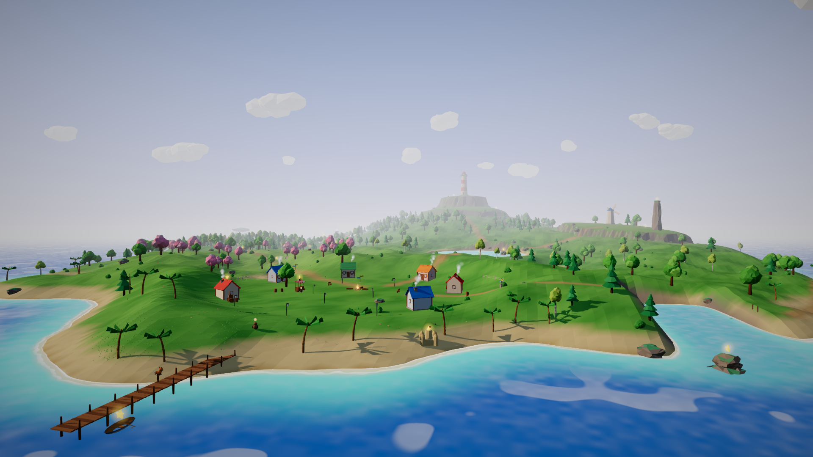
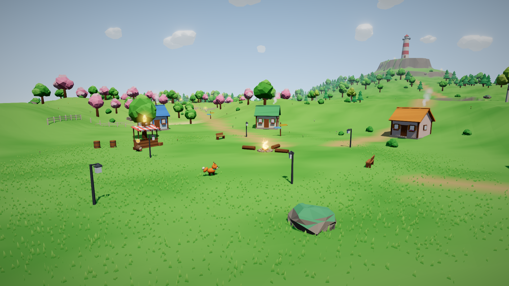
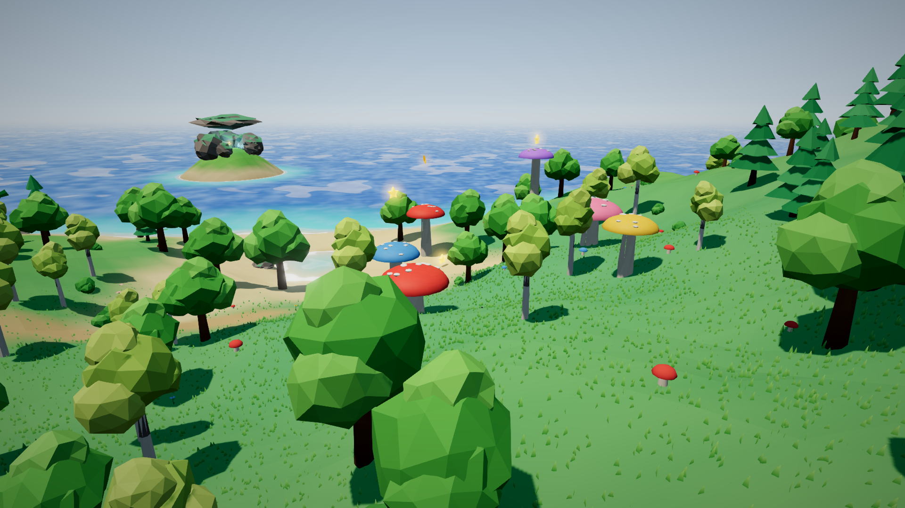
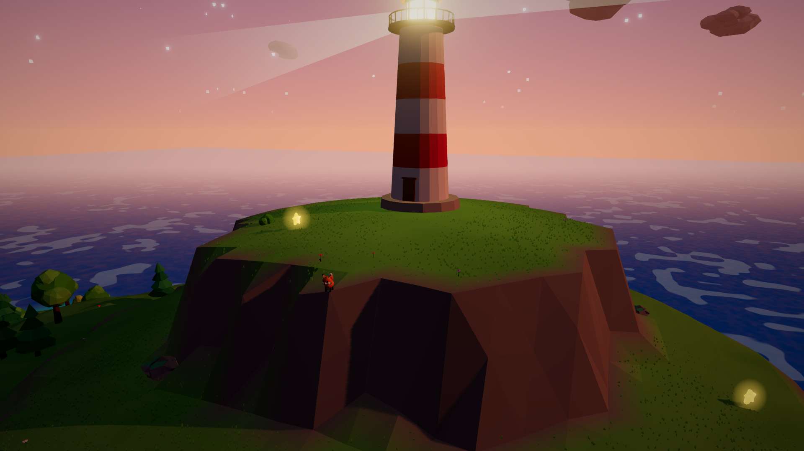
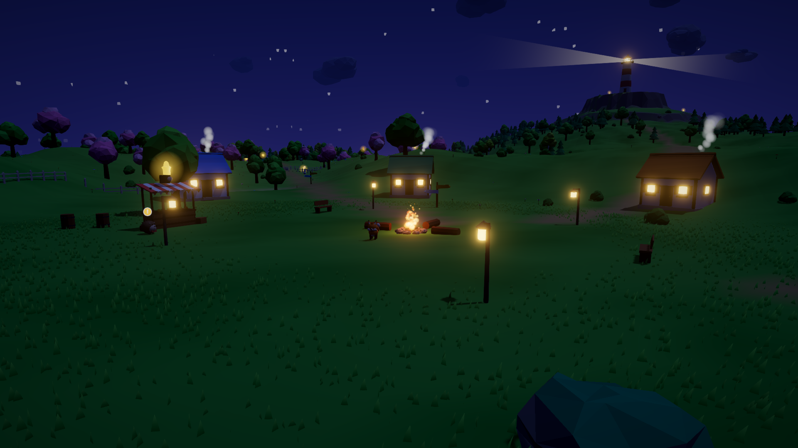

# Yıldız Adası / Starfall Isle

Rahat bir 3D ada macerası. Küçük tilki **Mina**, fırtınada sönen adanın
fenerini yeniden yakmak için gökten düşen yıldız parçalarını topluyor:
koşuyor, zıplıyor, altın tüylerle havada kanat çırpıyor, yaprağıyla
süzülüyor, yüzüyor ve adalılara yardım ediyor. Ölüm yok, acele yok; her
yaşa uygun.

Three.js + Rapier (fizik) + Vite · masaüstü için Electron · Steam için
steamworks.js · TR / EN



| | |
|---|---|
|  |  |
|  |  |

## İçerik

- **Ada:** 8 bölge + gizli bir mağara (Liman Köyü, Çiçekli Çayır, Fısıltı
  Ormanı, Kristal Göl, Batık Gemi Koyu, Mantar Vadisi, Rüzgârlı Kayalıklar,
  Fener Zirvesi, Yıldız Mağarası). Gece-gündüz döngüsü (12 dakika), ateş
  böcekleri, yanan pencereler, dönen fener ışığı.
- **Hareket:** koşma, depar, zıplama, her altın tüy için havada bir kanat
  çırpma, basılı tutunca süzülme, yüzme, zıplatan dev mantarlar, seni
  yukarı taşıyan rüzgâr sütunları.
- **Toplanacaklar:** 30 Yıldız Parçası (finale 20 yeter), 8 Altın Tüy,
  100 Deniz Kabuğu (dükkân parası).
- **Adalılar ve görevler:** Bilge Baykuş (ana görev), Diken Usta (dükkân:
  olta, tüy, parça, hasır şapka), Pamuk (kaçan havuçlar), Usta Kunduz
  (aletler → köprü), Zıpzıp (kurbağa yarışı), Koca Bal (balıkçılık).
- **Balıkçılık:** 6 tür; bazıları yalnızca gece ya da yalnızca gölde.
- **Final:** parçalar fenere akar, lamba yanar, havai fişekler, jenerik;
  sonra serbest oyun.
- **25 Steam başarımı**, photo mode (6 filtre), 3 kayıt yuvası, otomatik
  kayıt, tam gamepad desteği, ayarlar (ses, grafik kalitesi, hassasiyet,
  Y ters, yazı boyutu, kamera sarsıntısı, dil).

Bütün modeller kodla üretiliyor (harici model/doku yok), bütün sesler ve
müzik Web Audio ile anlık sentezleniyor (ses dosyası yok). Lisans derdi
yok, oyun küçük.

## Hızlı başlangıç

```bash
cd StarfallIsle
npm install

npm run dev            # tarayıcıda geliştirme (http://localhost:5173)
npm run electron:dev   # masaüstü penceresinde (Electron)
```

Paketleme:

```bash
npm run dist:win       # release/win-unpacked  (Windows'ta çalıştırın)
npm run dist:linux     # release/linux-unpacked
```

`dist:win` Linux'ta da çalışır ama exe'ye ikon/sürüm bilgisi yazmak için
Wine ister; en sağlıklısı Windows'ta üretmek.

## Kontroller

| Eylem | Klavye / fare | Gamepad |
|---|---|---|
| Hareket | WASD / ok tuşları | sol çubuk |
| Kamera | fare (pencereye tıkla), Q / R | sağ çubuk |
| Zıpla · havada kanat çırp · basılı tut: süzül | Space | A |
| Koş | Shift | B / RB / RT |
| Konuş · olta at · balığı çek | E | X |
| Günlük (harita, görevler, koleksiyon) | Tab | Back / View |
| Fotoğraf modu | P | Y |
| Mola menüsü | Esc | Start |

## Doğrulama

Hepsi bu depoda, GPU'suz bir Linux konteynerinde çalıştırıldı ve geçti.

| Komut | Ne yapıyor | Sonuç |
|---|---|---|
| `npm run verify` | node'da, oyunu açmadan: TR/EN anahtar eşitliği ve koddaki her anahtarın varlığı, başarım şeması, her istatistiğin kodda gerçekten artırıldığı, eşiklerin içerikle ulaşılabilir olduğu, dünya üretiminin deterministik olduğu, Rapier heightfield yöneliminin araziyle aynı olduğu, zıplama fiziğinin teras yüksekliklerine uyduğu (1 / 2 / 4 tüy), 136 eşyanın çarpışma içinde olmadığı / zemine yakın / su üstünde olduğu, mağara girişinin açık olduğu | 132 denetim |
| `npm run playtest` | gerçek tarayıcıda, gerçek oyun döngüsüyle uçtan uca: klavyeyle yürüme, zıplama yüksekliği, kanat çırpma, süzülme, yüzme, 136 eşyanın toplanması, 4 görev, dükkân, balık, yarış, 9 bölge, final, **25/25 başarım**, %100 tamamlanma, sayfa yeniden yüklenince kaydın ve başarımların korunması | 37 denetim |
| `npm run smoke` | gerçek Electron penceresi: oyun yüklenir, Steam yoksa yerel moda düşer, preload köprüsü üzerinden diske kayıt gidiş-dönüşü | OK |
| `npm run capture` | bölgeler, günün saatleri, adalılar, menüler, final: `tools/out/shots/` | konsol hatası 0 |
| `npm run icons` | başarım ikonları + uygulama ikonu + `steam/ACHIEVEMENTS.md` | 100 ikon |
| `npm run store-art` | Steam mağaza/kütüphane görselleri + ekran görüntüleri (TR, EN) | `steam/store_art/` |
| `npm run dist:linux` + paketlenmiş ikiliyle duman testi | electron-builder paketi; Steam yerel modülü `app.asar.unpacked` içinden yükleniyor, kayıt gidiş-dönüşü çalışıyor | OK (~330 MB, çoğu Electron/Chromium) |

Testler yazılımsal WebGL (SwiftShader) ile çalışıyor; orada oyun saniyede
1-2 kare çiziyor. Simülasyon yavaş karelerde 1/60 sn'lik alt adımlara
bölündüğü için oyun zamanı yine gerçek zamanla akıyor; testler gerçek saat
yerine oyun saatine bakıyor.

## Proje yapısı

```
StarfallIsle/
  index.html, vite.config.js, package.json   (electron-builder ayarları dahil)
  electron/main.cjs, preload.cjs             pencere, steamworks.js, kayıt IPC
  src/core/       Game (durum makinesi, döngü), Input, Save, Settings, Platform, i18n
  src/world/      Terrain (yükseklik haritası, node'da da çalışır), WorldData (tüm
                  yerleşimler), World (sahneyi kurar), TerrainMesh, noise
  src/models/     Fox, Animals (6 adalı), Nature, Buildings, Collectibles, geom, palette
  src/render/     Renderer (post-process, kalite ön ayarları), Sky, Water, Grass,
                  Particles, Clouds
  src/physics/    Physics (Rapier: heightfield, yapılar, karakter kontrolcüsü)
  src/gameplay/   Player, CameraRig, Collectibles, Npc, Quests, Race, Fishing,
                  Lighthouse (final), PhotoMode
  src/achievements/ achievements.json, Stats, AchievementTracker, iconArt
  src/audio/      Audio (sentez SFX), Music (üretken), Ambience
  src/ui/         UI, Hud, Screens, DialogueBox, Credits, PhotoOverlay, ui.css
  src/i18n/       tr.json, en.json
  steam/          steam_appid.txt, VDF şablonları, ACHIEVEMENTS.md,
                  achievement_icons/, store_art/
  tools/          verify, playtest, capture, smoke, electron-smoke, gen-icons, store-art
```

Yeni içerik eklemek: yıldız/tüy/kabuk/adalı konumları `src/world/WorldData.js`,
başarımlar `src/achievements/achievements.json` (eşikler veriden gelir,
koda dokunmak gerekmez), metinler `src/i18n/*.json`. Ekledikten sonra
`npm run verify` yeni eşyanın erişilebilir bir yerde olup olmadığını söyler.

## Tasarım sayıları

- Zıplama tepe yüksekliği `10² / (2·28) ≈ 1,79 m`, her kanat çırpma
  `≈ 1,45 m` ekler. Teraslar buna göre: zirvenin ilk terası 2,7 m
  (1 tüy), Rüzgârlı Kayalıklar 4,0 m (2 tüy), fenerin son yarı 6,8 m
  (4 tüy). Tüy ilerleyişi: baykuş + çayır kütüğü → kayalıklar → vadideki
  mantar → zirve. `verify` bunu her çalıştırmada ölçer.
- Mantar zıplatması `17² / 56 ≈ 5,2 m`.
- Tamamlanma yüzdesi: parça, tüy, kabuk, balık türü, görev, bölge, final
  ve gizli mağaranın ortalaması.
- Zaman: 24 oyun saati = 12 gerçek dakika. Kamp ateşinde sabaha, akşama
  ya da gece yarısına kadar dinlenilebilir.

## Steam'e çıkış kontrol listesi

Kodda Steam tarafı hazır; aşağıdakiler sizin hesabınızla yapılması
gereken adımlar.

1. **Steamworks hesabı** açın ve Steam Direct ücretini ödeyin (uygulama
   başına). Size bir **App ID** ve depo (depot) ID'leri verilir.
2. `steam/steam_appid.txt` içindeki `480`'i (Valve'in test uygulaması)
   kendi App ID'nizle değiştirin. `steam/app_build.vdf` ve
   `steam/depot_build_*.vdf` içindeki 480/481/482'yi de değiştirin.
   App ID 480 değilse paketlenmiş oyun Steam dışından açıldığında Steam
   üzerinden yeniden başlar (`restartAppIfNecessary`).
3. **Başarımlar:** partner sitesinde *Stats & Achievements* sayfasına
   `steam/ACHIEVEMENTS.md` tablosundaki 25 başarımı ve istatistikleri
   girin; ikonlar `steam/achievement_icons/` (256x256, kilitli sürümler
   `_locked`). API adları birebir aynı olmalı. Yayımlamayı (Publish)
   unutmayın.
4. **Steam Cloud:** *Auto-Cloud* ile kayıt klasörünü ekleyin:
   Windows `%APPDATA%/Starfall Isle/saves/`, Linux
   `~/.config/Starfall Isle/saves/`, desen `*.json`.
5. **Mağaza sayfası:** `steam/store_art/` altındaki capsule'lar,
   kütüphane görselleri ve 9 ekran görüntüsü Steam'in istediği ölçülerde.
   Açıklama, etiketler (Cozy, Exploration, 3D Platformer, Cute, Family
   Friendly…), sistem gereksinimleri, yaş derecelendirme anketi (IARC).
6. **Derleme ve yükleme:** Windows'ta `npm run dist:win`, isterseniz
   `npm run dist:linux`; sonra Steamworks SDK'daki steamcmd ile
   `steamcmd +login <kullanıcı> +run_app_build <tam yol>/steam/app_build.vdf +quit`.
7. **Steam Deck:** oyun 1280x800'de okunur, tamamen gamepad ile oynanır;
   Deck Verified incelemesine başvurun. Windows deposu Proton ile de çalışır.
8. Steam'in **inceleme süreci** ve "Çok Yakında" sayfasının yayında
   kalması gereken asgari süre için Steamworks belgelerine bakın.

## Dürüst sınırlar

- **Steam entegrasyonu gerçek bir Steam istemcisine karşı denenmedi.**
  Bu konteynerde Steam yok: steamworks.js'in yerel modülü yükleniyor,
  `SteamAPI_Init` "steamclient.so yok" diyerek başarısız oluyor ve oyun
  tasarlandığı gibi yerel moda düşüyor (`npm run smoke` bunu gösterir).
  Başarımların Steam'de gerçekten açıldığını Steam açıkken, kendi App
  ID'nizle bir kez deneyin.
- **Performans gerçek bir GPU'da ölçülmedi.** Testler yazılımsal render
  ile yapıldı. Üç kalite ön ayarı var (Düşük / Orta / Yüksek); Steam
  Deck ve eski dizüstüler için "Düşük" ile başlayıp ölçmek gerekiyor.
- **Modeller prosedürel:** tutarlı ve sevimli, ama profesyonel bir
  sanatçının elinden çıkmış gibi değil. Özellikle mağaza capsule'ları
  için bir illüstratörle çalışmak tıklanma oranını belirgin artırır.
- **Ses sentezle üretiliyor:** hoş ve tutarlı, ama kayıtlı enstrüman
  kalitesinde değil. Bir besteciyle çalışmak sonraki doğal adım.
- Tuş ataması (yeniden atama) ekranı yok; varsayılan tuşlar sabit.
- Diller: Türkçe ve İngilizce. Yeni dil = yeni bir `src/i18n/xx.json`;
  `npm run verify` eksik anahtarları listeler.

## Lisanslar

Kullanılan açık kaynak: three.js (MIT), Rapier (Apache-2.0), Electron
(MIT), steamworks.js (MIT), Nunito ve Baloo 2 yazı tipleri (SIL OFL,
@fontsource üzerinden paketlenir). Oyunun kendi kodu ve içeriği size ait;
`package.json` içindeki `license` alanı `UNLICENSED` (kapalı kaynak) olarak
bırakıldı.
